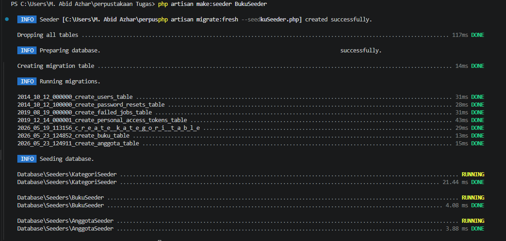
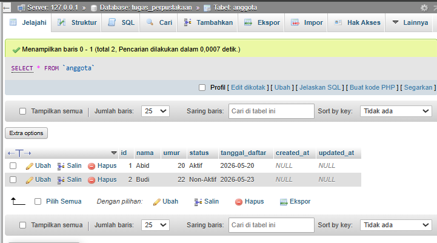
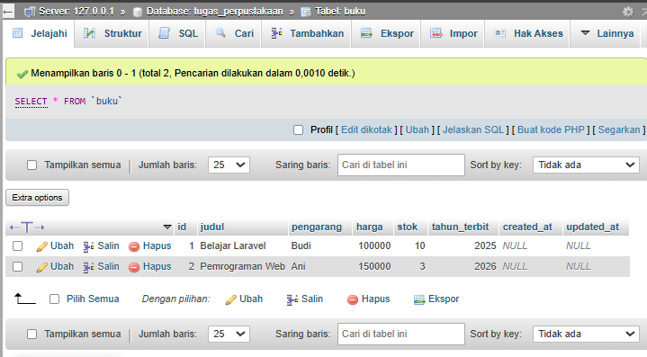
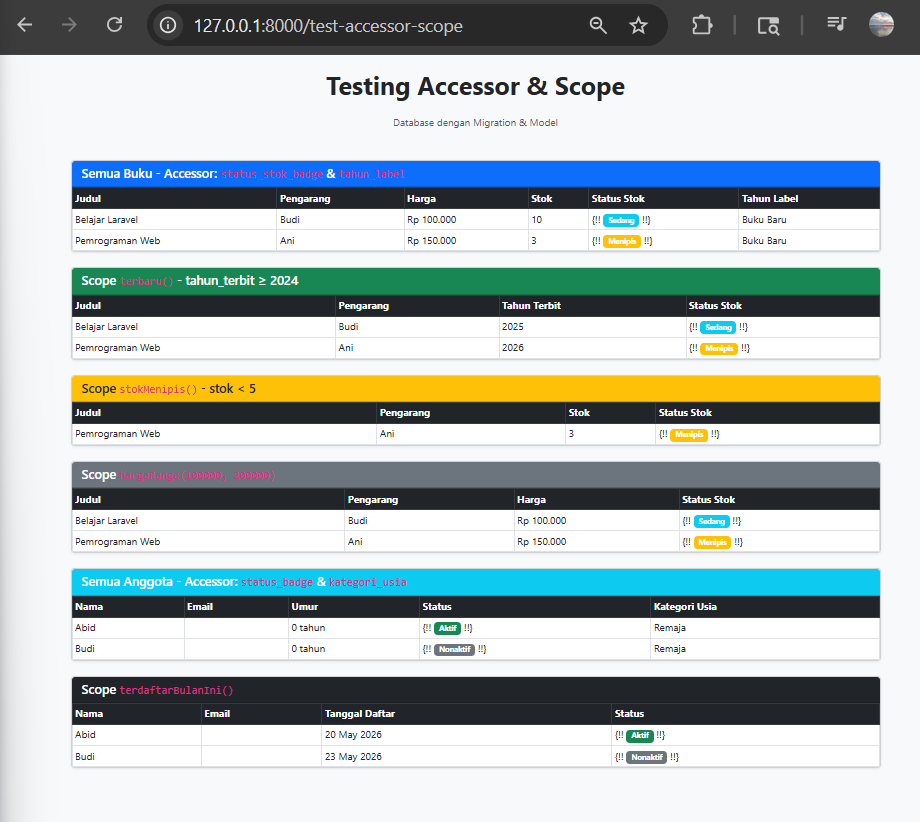

# Tugas Pertemuan 10: Accessor & Scope

Dokumentasi:

### 1. Hasil Migration & Seeding

### 2. Data pada Database (phpMyAdmin)

**Tabel Anggota:**

**Tabel Buku:**

### 3. Tampilan Halaman Testing

### File Kodingan
- [file Tugas - P10](Tugas%20Pertemuan%2010/Code/)
