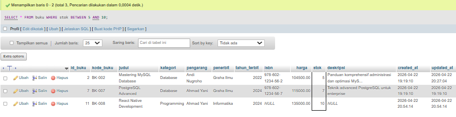

# Tugas 1 — Eksplorasi Query
## Pemrograman Website 2
**Nama:** M. Abid Azhar  
**NIM:** 051  
**Dosen:** Mohammad Reza Maulana, M.Kom

---

### 1. Total Buku

### 2. Total Nilai Inventaris

### 3. Rata-rata Harga

### 4. Buku Termahal

### 5. Stok Terbanyak

### 6. Filter Kategori dan Harga

### 7. Search LIKE PHP atau MySQL

### 8. Filter Tahun Terbit

### 9. Stok Antara 5-10

### 10. Berdasarkan Nama Pengarang

### 11. Kategori Jumlah dan Stok

### 12. Rata-rata Harga per Kategori

### 13. Nilai Inventaris Terbesar

### 14. Sebelum Update Harga

### 15. Sesudah Update Harga

### 16. Sebelum Update Stok

### 17. Sesudah Update Stok

### 18. Stok Kritis Restocking

### 19. Top 5 Buku Termahal

### 20. Update Harga Buku

