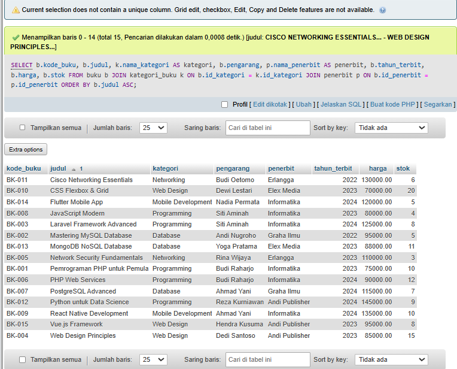
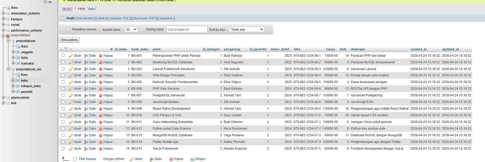
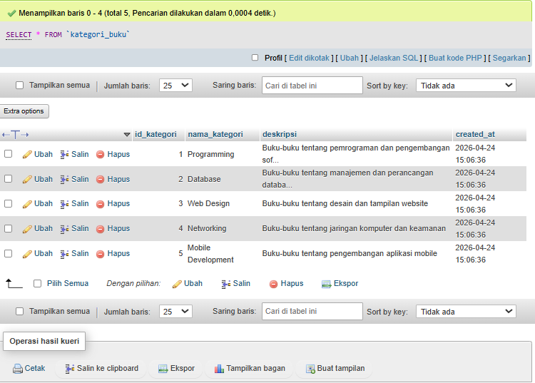
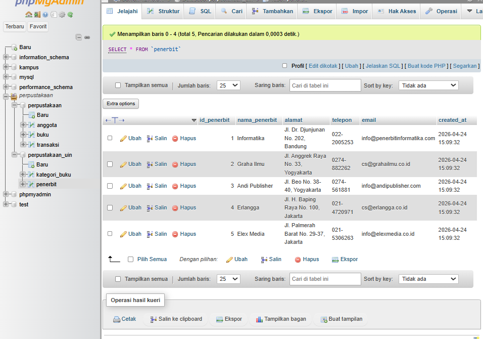

# Tugas 2 — Desain Database Lengkap
## Pemrograman Website 2
**Nama:** M. Abid Azhar  
**NIM:** 051  
**Dosen:** Mohammad Reza Maulana, M.Kom

---

## File SQL
`Tugas2-M.AbidAzhar_051.sql`

---

## ERD

---

## Query JOIN

### JOIN Buku + Kategori + Penerbit

### Jumlah Buku per Kategori

### Jumlah Buku per Penerbit

### Detail Lengkap Kategori dan Penerbit

---

## Data Tabel

### Data Tabel Buku

### Data Tabel Kategori

### Data Tabel Penerbit

---

## Struktur Tabel

### Struktur Tabel Buku

### Struktur Tabel Kategori Buku

### Struktur Tabel Penerbit

### Struktur Tabel Rak

